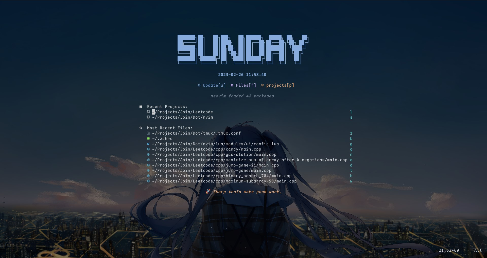
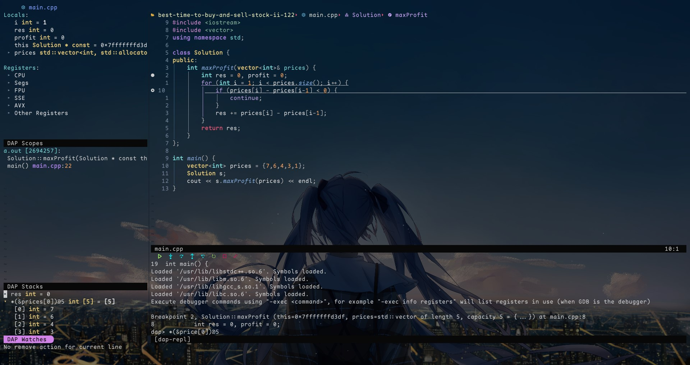

# Neovim






## Usage

### Install

```shell
ln -s /path/to/Dots/nvim ~/.config/nvim
```

### Introduce

Dependencies:

- Basics configuration: <a href="https://github.com/glepnir/dope">`dope`</a>

- Plugin manager: `packer.nvim`

- Lsp: `nvim-lsp`

- Debug: `nvim-dap`

- Formater: `null-ls`

- Language tools: `Mason.nvim`

Support languages

- Lsp support: You can find them in `./lua/modules/lang/lsp.lua`.

- Dap support: You can find them in `./lua/modules/lang/dap.lua`.

### How to configure

```tree
.
├── init.lua
├── lua
│  ├── core
│  │  ├── helper.lua
│  │  ├── init.lua
│  │  ├── keymap.lua
│  │  ├── options.lua
│  │  └── pack.lua
│  ├── keymap
│  │  ├── config.lua
│  │  └── init.lua
│  └── modules
│     ├── editor
│     │  ├── config.lua
│     │  └── plugins.lua
│     ├── lang
│     │  ├── config.lua
│     │  ├── dap.lua
│     │  ├── lsp.lua
│     │  └── plugins.lua
│     ├── tools
│     │  ├── config.lua
│     │  └── plugins.lua
│     └── ui
│        ├── config.lua
│        ├── plugins.lua
│        └── statusline.lua
└── static
   └── neovim.cat
```

`./core`: The `dope` core.

`./keymap`: Key bindings.

`./modules`: You can find plugins in`plugins.lua` and configure plugins in `config.lua`.

## ToDo

- [ ] `C/Cpp/Rust` debug path choose.

- [ ] Change package management to `lazy.nvim`.

- [ ] Add `nvim-notify`.

- [ ] Remove the dependencies of `dope`.

- [ ] Reorgnize the keymaps.

## Note

- Debug keymap is like Jetbrain's IDE.

- If you write Java or Front-End, `IDEA` or `VsCode` are better choice.

- For huge projects，i deem that you need spend more times on project, nor configure nvim.
