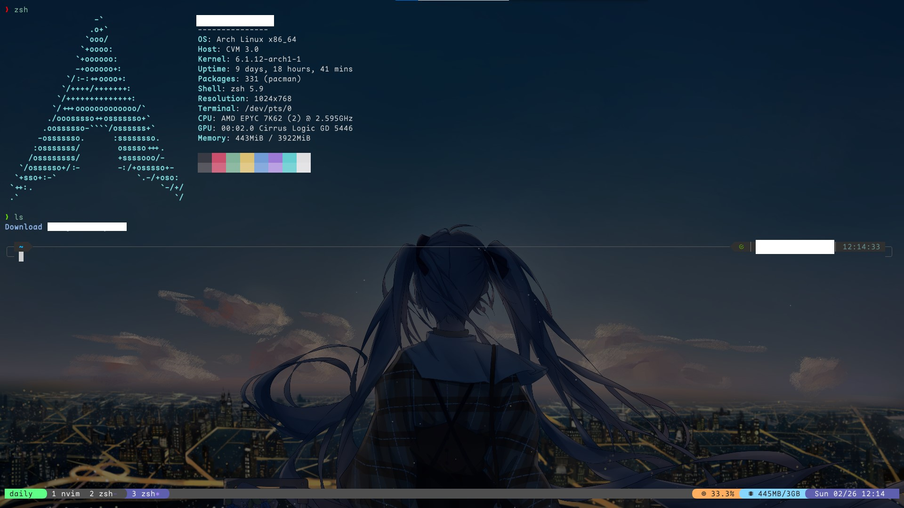

# Zsh



## Usage

```shell
ln -s /path/to/Dots/zsh/.zshrc ~/.zshrc
source ~/.zshrc
```

## Requirements

- Editor: `neovim`

- Theme:  <a href="https://github.com/romkatv/powerlevel10k">`powerlevel10k`</a>

- Cli Tools: 
  
  - Mandatory: `exa`, `htop`, `batcat`, `ripgrep`, `htop`, `ncdu`, `pnpm`, `neofetch`
  
  - Optional: `yq`, `jq`, `btop++`

- Containerd: `podman`

- Version Manages： `nvm`, `gvm`, `sdkman`, `pyenv`

- Terminal Emulator  Font: <a href="https://github.com/subframe7536/Maple-font">`Maple Font`</a>

## ToDo

- [ ] Auto install version manages.

- [ ] Auto install and cionfigure`powerlevel10k`.

- [ ] Move `~/.zplug` to `.local/share``.
